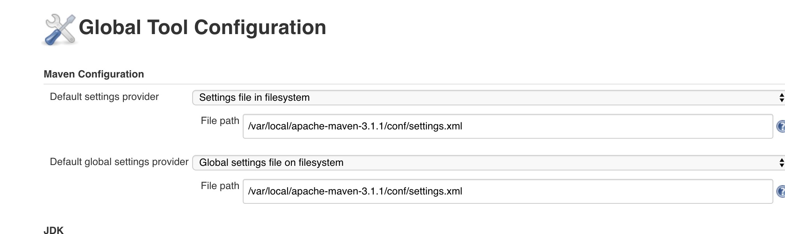
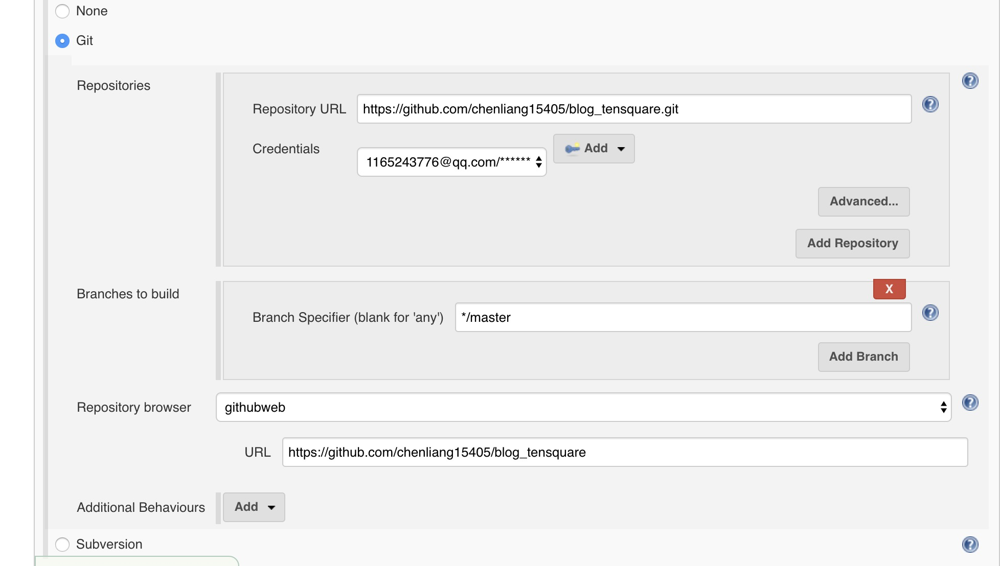
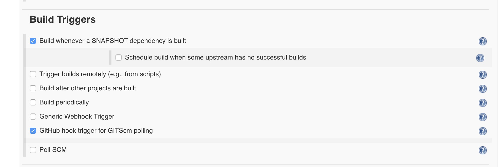
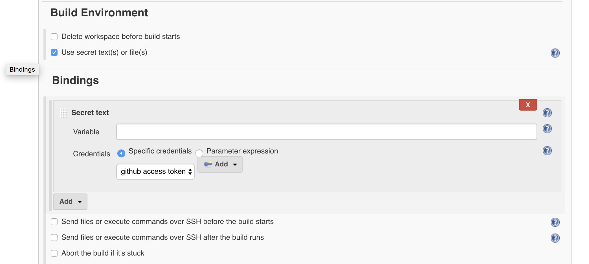
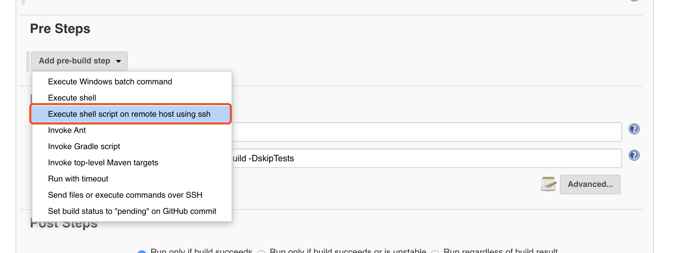
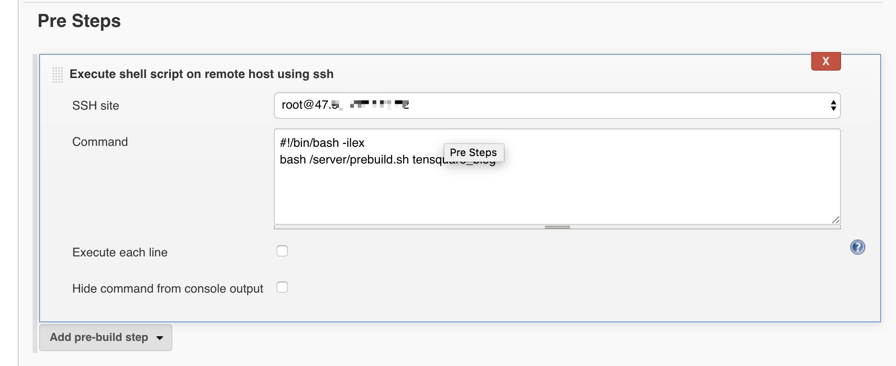
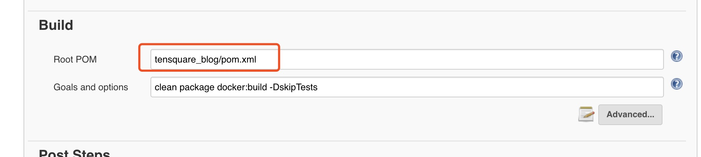
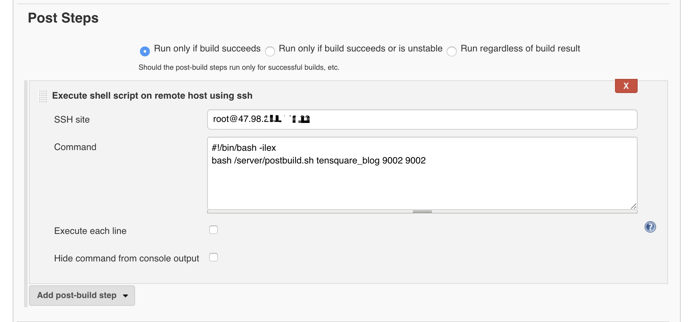

### Docker、Jenkins自动化部署项目到服务器

> 使用Jenkins自动构建、制作Docker镜像，并发布镜像到服务器，自动化备份项目，
启动容器，使用Docker容器运行springboot项目


##### 一、 Github配置Webhooks

（1）在工程主页面点击右上角的"Settings"，再点击左侧"Webhooks"，然后点击“Add webhook”   
（2） 在"Payload URL"位置填入Webhook地址，再点击底部的"Add webhook按钮"，这样就完成webhook配置了，今后当工程有代码提交，GitHub就会向此webhook地址发请求，通知Jenkins构建。
        其中，Webhook地址为： `jenkins的访问地址/github-webhook`， 例如： http://192.168.0.1:8080/github-webhook
        
 (3) 生成Personal Access token   
     - 登录GitHub，进入"Settings"页面，点击左下角的"Developer settings"
     - 跳转到"Developer settings"页面后，点击左下角的“Personal access tokens”
     - 跳转到"Personal access tokens"页面后，点击右上角的"Generate new token"按钮
     - 可能会提示输入GitHub密码，输入后跳转到创建token的页面，输入title，再勾选"repo"和"admin:repo_hook"，再点击底部的"Generate token"按钮，就能产生一个新的access token，将此字符串复制下来，后面jenkins任务中会用到
   
##### 二、 Jenkins配置

（1）检查Jenkins插件是否已经安装；   
    `GitHub Plugin`    
    `Generic Webhook Trigger Plugin`   
    `Maven Integration plugin`  
    `SSH plugin`
    
 (2) 配置GitHub，点击“系统管理->系统设置”
   - 在系统设置页面找到"GitHub"，配置一个"GitHub Server"，“API URL"填写"https://api.github.com",
   “Credentials" 选择"Add->Jenkins”：
   - 弹出的页面中，“Kind"选择"Secret text”，"Secret"填入前面在GitHub上生成的Personal access tokens，Description随便写一些描述信息
   - 填写完毕后，点击右侧的"Test connection"按钮
   - 点击页面最底部的"保存"按钮 
   
 (3) 配置SSH服务器
   - 系统管理中，有一个"SSH remote hosts"的可配置项（如果没有该项，就是没有安装SSH 插件）
    
   
##### 三、 配置Jdk、maven

进入系统管理->全局工具配置   
 (1) jdk
  
 (2) maven
 
 
 需要注意的是：
   如果是使用的宿主机的maven,并且使用的是宿主机中maven的setting配置文件中的maven自定义maven仓库，
   那么还需要做以下的配置,指定maven的配置文件替换jenkins中默认的全局maven配置:
   
   

##### 四、 开始构建项目
> ok， 经过上面的一系列准备工作，需要的jenkins配置就已经完成了，下面就开始创建jenkins项目开始构建

 **1. 创建 maven项目，并开始配置**   
 (1) 设置源码管理配置   
 - Repository URL： 这个是该项目的git地址
 - URL： 这个里面配置的是github项目的url，不是Git的链接，是访问项目的地址栏url
 
 
**2. 构建时触发**
> 配置github提交代码然后触发构建


**3. 构建环境**
> 其实就时将第一步中申请的personal access token配置给jenkins来获取权限



**4. 配置构建前执行脚本**   
（1）选择执行远程服务器上的脚本选项 
  
 (2)  选择ssh的服务器，如果没有选项可以选择（表示没有配置，则在jenkins的凭证中加一个即可）   
 (3) 最后会给出prebuild.sh脚本
  

**5.配置执行命令**   
> 下图汇总红框标注的 pom.xml是因为配置的工程是多模块，里面包含有多个子模块，则需要指定对应的子模块，如果是单体结构，则执行指定为pom.xml即可
> 执行的命令为构建docker镜像的命令，在项目的pom.xml中加入了maven_docker的插件


**6. 配置构建后的操作**   
> 和构建前相同，也是执行服务器中的一个脚本 postbuild.sh（脚本在后面贴出）   


**7.配置完成**   
ok, 配置完成，接下来只需要提交代码到github的该工程下，jenkins就会自动编译并部署了，一键部署～


<br/>

**prebuild.sh** 
> 执行脚本删除容器，并删除旧的镜像。里面有一些参数修改一下即可 

> 执行脚本的时候需要传递一个参数，该参数为构建的容器名称
```bash
#!/bin/bash

export PATH=/bin/bash:$PATH
source ~/.bash_profile
source /etc/profile

# project name
container_name=$1
image_name='tensquare-blog/'$container_name:1.0-SNAPSHOT

echo 'container name : '$container_name

echo 'image_name: '$image_name

#stop and rm container and images
docker stop $container_name

docker rm $container_name

# delete image
IMAGE_ID=$(docker images | grep "$container_name" | awk '{print $3}')

echo "image id : "$IMAGE_ID

if [ -z "$IMAGE_ID" ]
then
    echo no images need del
else
    echo "rm images:" $IMAGE_ID
    docker rmi -f $IMAGE_ID
fi

echo 'successful'

```

**postbuild.sh**   
> 执行后构建的脚本，根据jenkins构建后的镜像，重新运行一个容器   

> 该脚本需要传递3个参数：   
   第一个参数为容器的名称（和prebuild.sh的名称保持一致）   
   第二个参数为宿主机的映射端口
   第三个参数为docker容器中的端口即springboot项目应用端口

```bash
#!/bin/bash

source ~/.bash_profile
source /etc/profile

#项目名称
CONTAINER_NAME=$1
#宿主机端口
HOST_PORT=$2
#应用端口
APP_PORT=$3

echo "docker run container name: ${CONTAINER_NAME}, host_port: ${HOST_PORT}, app_port: ${APP_PORT}"

docker run -d  --name $CONTAINER_NAME \
-p $HOST_PORT:$APP_PORT \
-v /server/logs/$CONTAINER_NAME:/server/logs/$CONTAINER_NAME \
'tensquare-blog/'$CONTAINER_NAME':1.0-SNAPSHOT'

echo "successful run"

```

