##### Jenkins自动化部署项目到远程服务器
----

> 背景: 因为项目每次都需要手动发布，一台服务器还好，如果是多台服务器，那么就比较麻烦，并且
发布的人不同，那么对于发布的流程，执行什么命令，发布包放在哪个文件夹这些问题也是需要去了解，
所以就想到使用自动话部署的方式，改进发布模式，于是经过查询资料和测试实践，基本达到了目的。

[Jenkins的安装方式（两种）](http://)可以看这篇文章

### 本篇介绍如果使用jenkins达到自动化部署---springboot项目版本（jar包）和tomcat项目（war包）

1. 打开安装好的jenkins，安装对应的插件
   （1）pushlish over ssh    
    (2) maven intergration   
    (3) git   
	ps： 初始化已经安装的，就不用安装了   

####2. 在系统设置中配置SSH Server

第一步
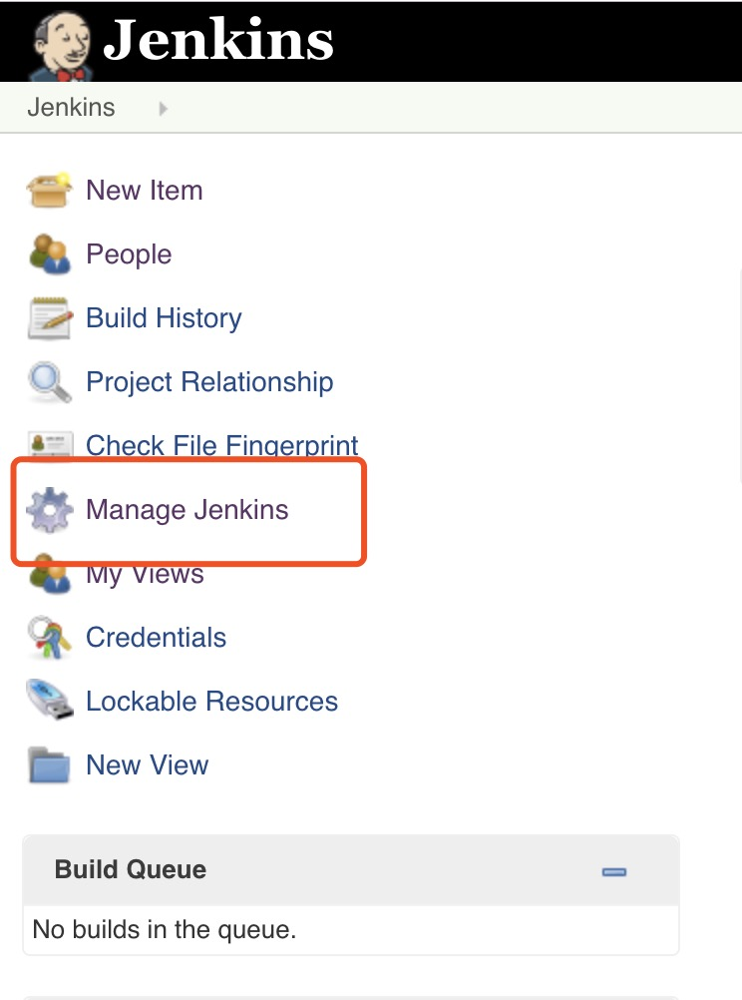
   
第二步：
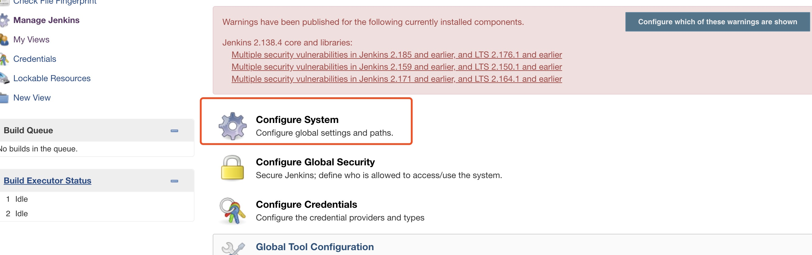
    
第三步：
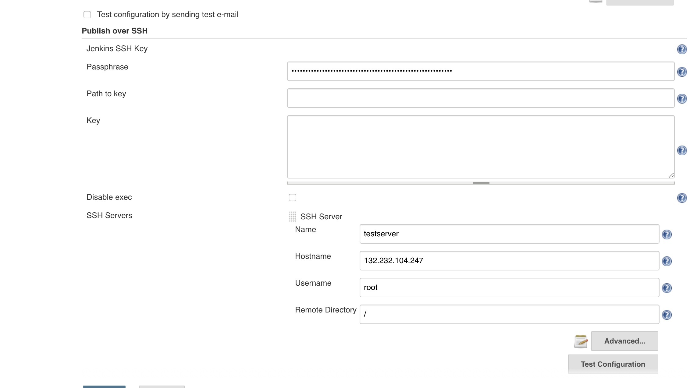
    
第四步： 配置ssh server
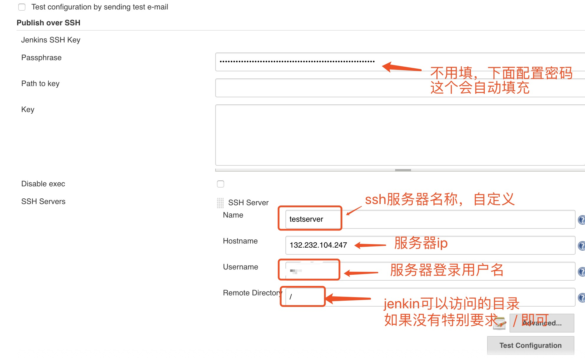
    
点击高级：
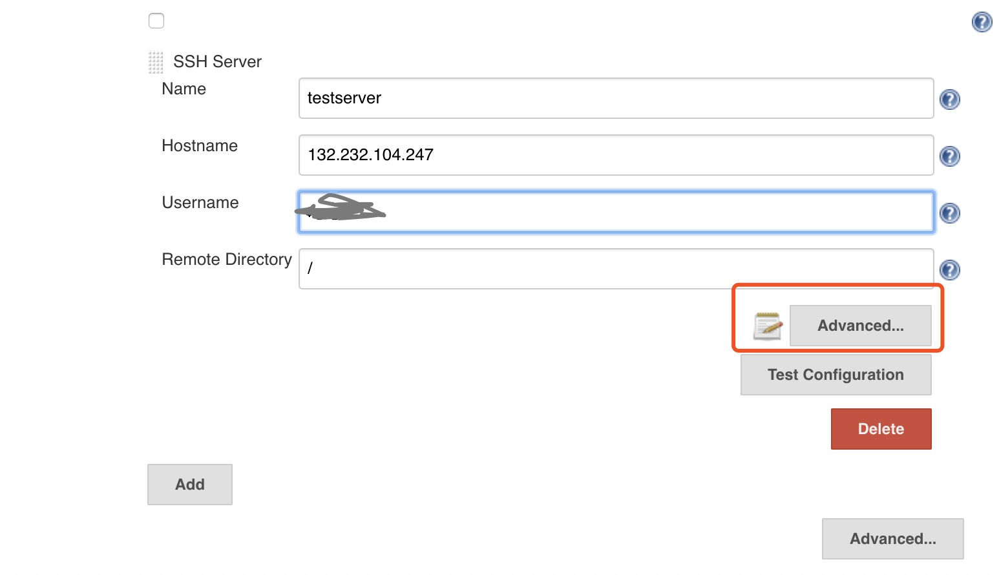
    
输入服务器密码：
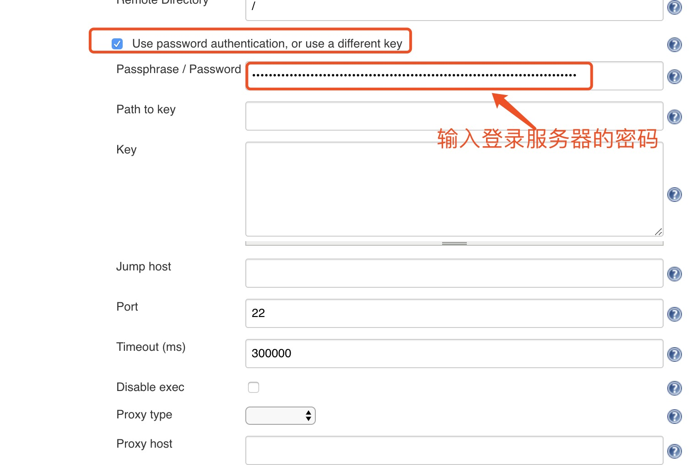

    
   然后点击保存。
   
    
#### 3. 构建项目   
（1）开始创建一个新项目
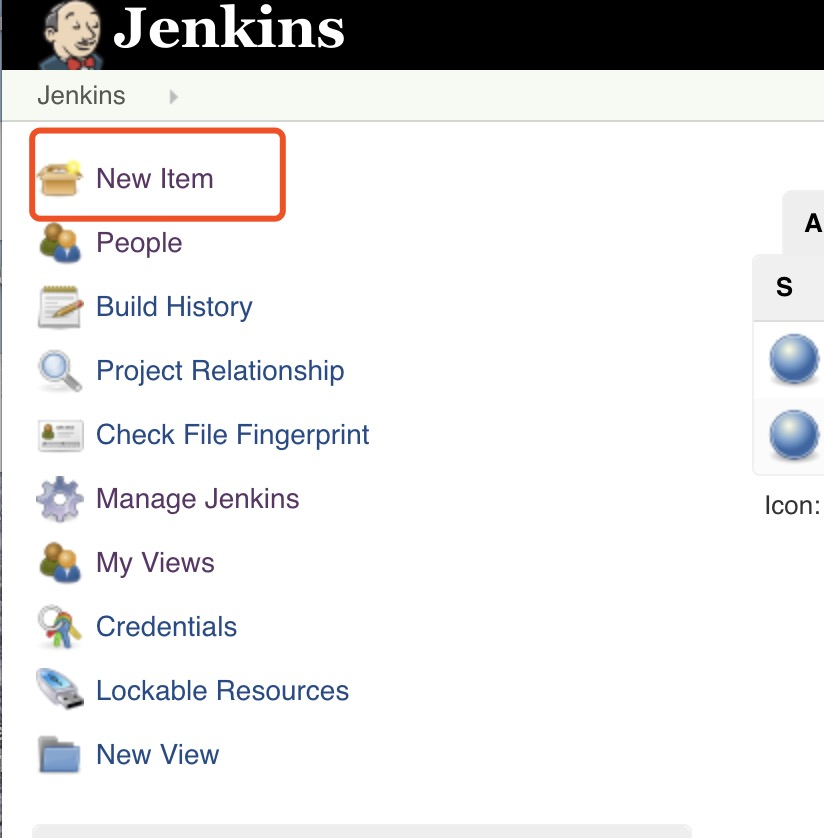
（2）选择丢弃旧的构建，设置最大的构建数为10个（自定义）
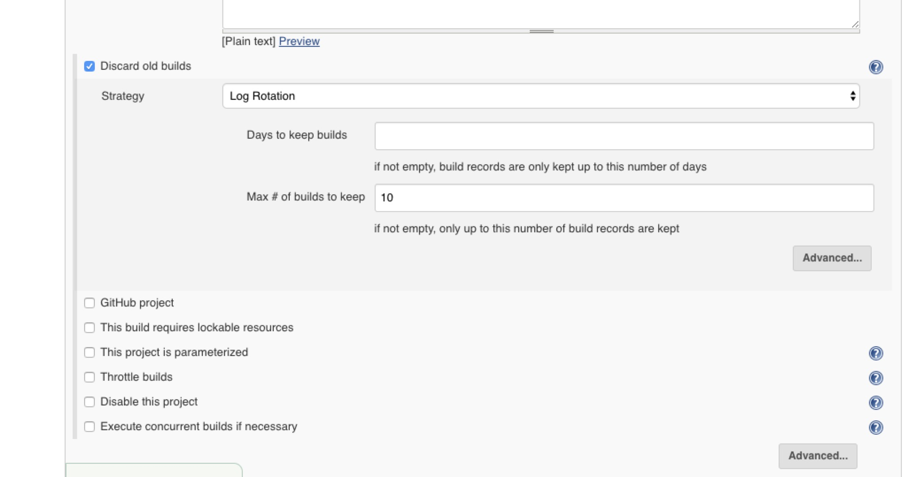

 (3) 选择使用maven构建项目   
<font color=red>如果没有这个maven构建项目的选项</font>，请安装插件<font color=red>Maven Intergration</font>   
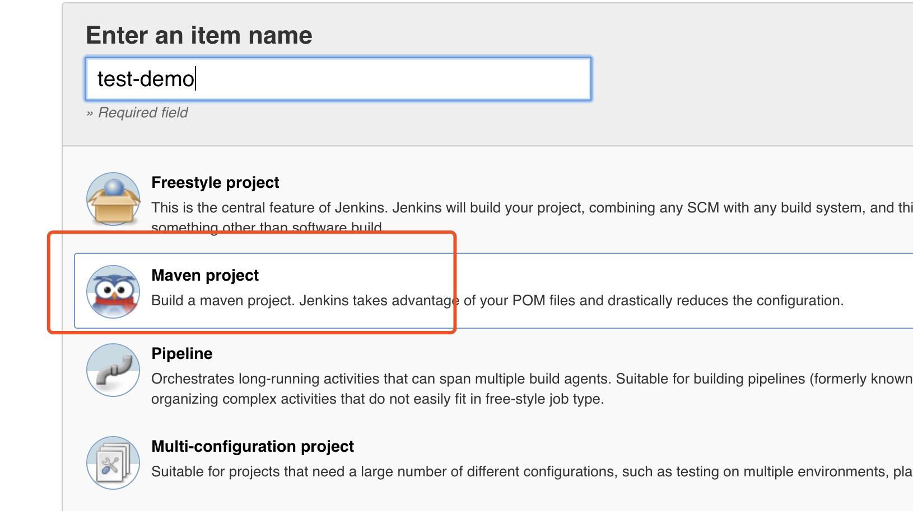

（4）配置项目的仓库地址：例如github，然后添加账号、密码
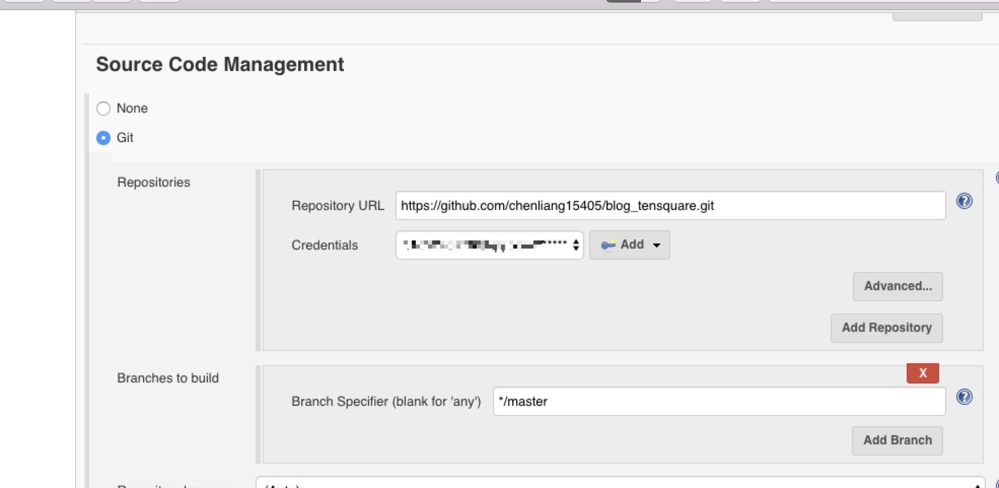

（5）配置build时的pom.xml和build项目时执行的命令   
ps: 如果是多模块项目，则需要指定构建的对应的子模块的pom.xml，如果是单模块，则不需要修改，使用pom.xml
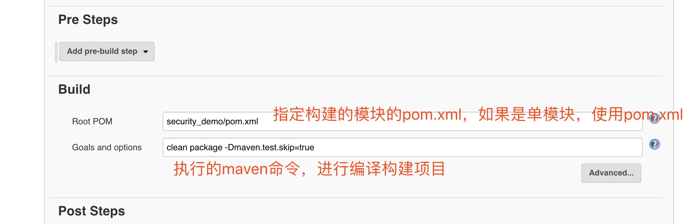

 (6) 配置构建之后执行的步骤：   
  1> 选择发送文件和执行命令在ssh server
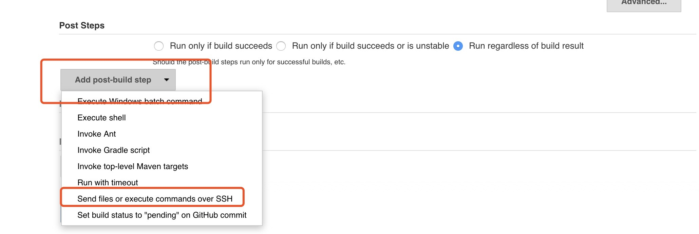
  2> 配置发送jar包到远程服务器的配置
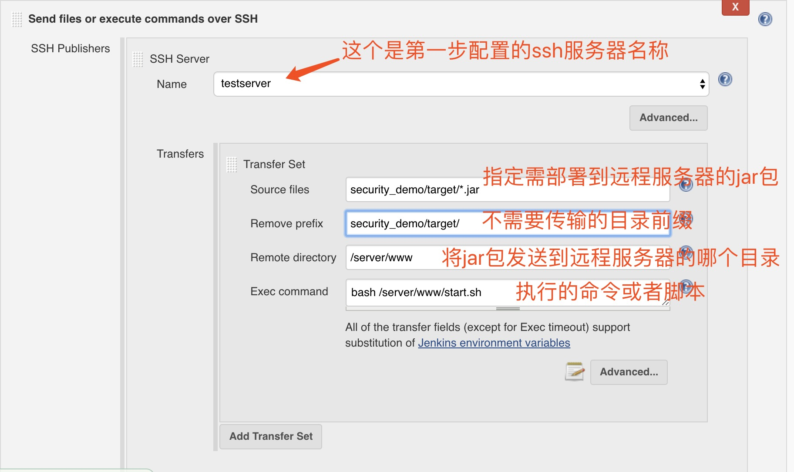
 
 (7) 点击保存，然后构建项目即可,控制台可以查看日志
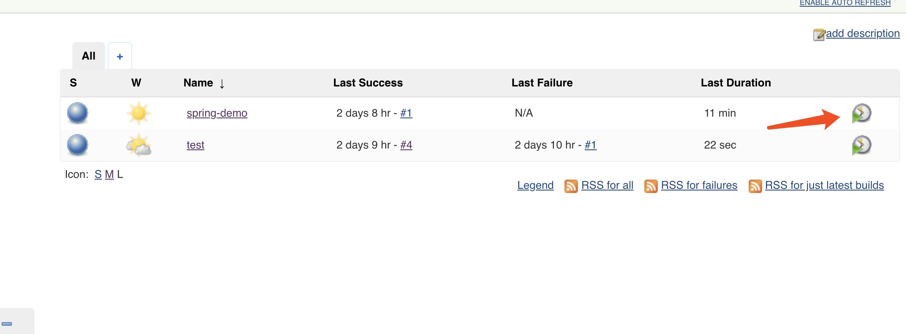  
  
  4> 查看日志，构建完成之后，登录ssh 服务器，查看对应的目录下是否有传输的jar包，项目是否启动即可
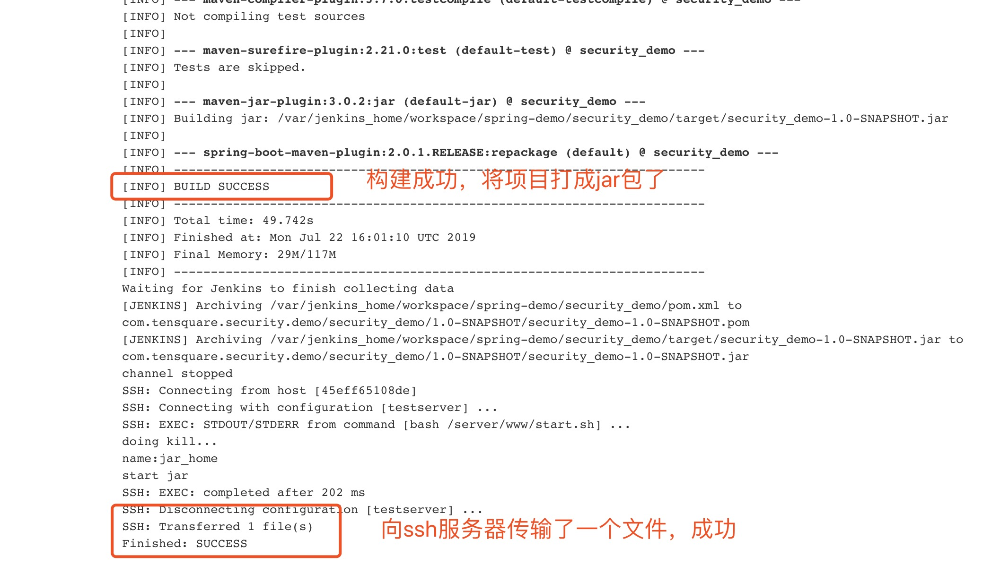  
  
  (8) 查看远程服务器
  jar已经传输过去
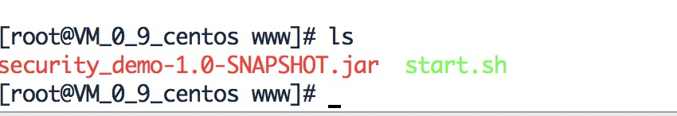  
  并且服务已经启动   
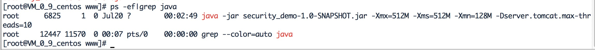  


*<font color=green> OK!  springboot版本的已经部署成功。</font>*
如果想要尝试的，可以自己部署一个，很简单的～，<font color=red>实践出真知</font>
  
  
 *另*： 这个就是放在远程服务器的脚本 start.sh 脚本，用来启动springboot打包后jar 
```bash
#!/bin/bash
# 进入到目录下
cd /server/www

# 可以在这里杀死上一个进程
echo "doing kill..."

# 定义环境变量
export JAVA_HOME=/server/jdk/jdk1.8.0_212
export PATH=$JAVA_HOME/bin:$PATH

# 后台启动jar包
nohup java -jar security_demo-1.0-SNAPSHOT.jar -Xmx=512M -Xms=512M -Xmn=128M -Dserver.tomcat.max-threads=10 >/dev/null 2>&1 &

echo "start jar"

exit 0

```
  
  