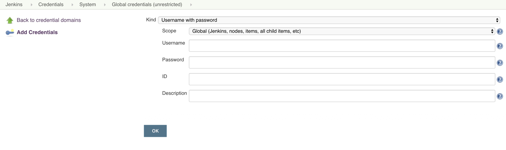
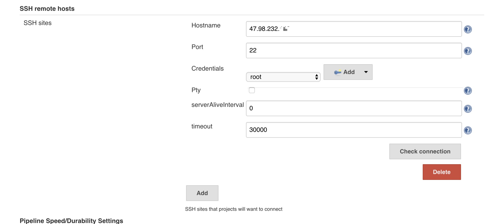
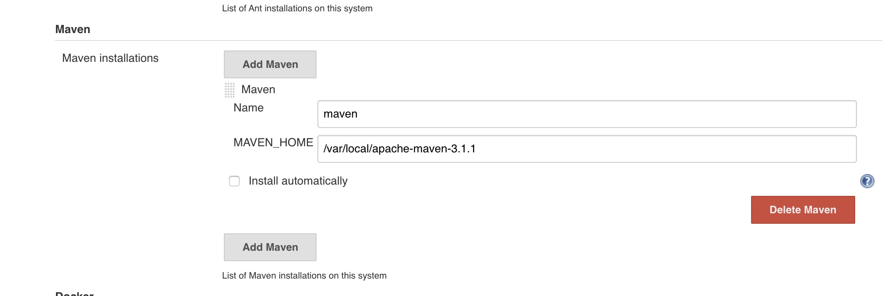
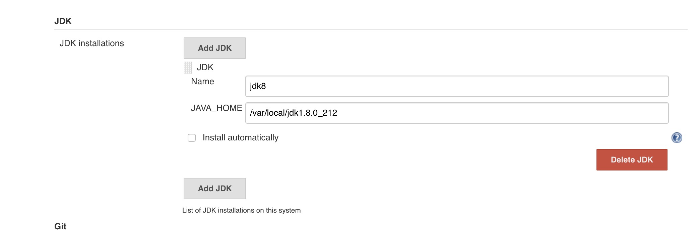
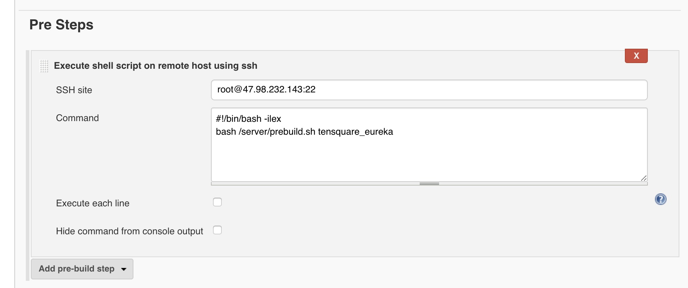
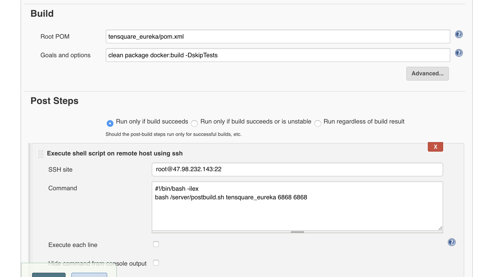

### jenkins集成github实现提交自动部署

**一、 安装jenkins插件**
 - ssh  （链接远程服务器，执行脚本或者命令）
 - Generic Webhook Trigger Plugin (提交代码触发钩子插件)
 - Maven Integration plugin （maven项目集成插件）
 - GitHub Plugin (github插件)
 
**二、配置github webhook**
https://blog.csdn.net/boling_cavalry/article/details/78943061
 
 
**三、 安装完成之后配置凭证**
 (1)进入Credentials中，配置ssh服务器的凭证，可以使用账号密码或者密钥
 (2)在全局配置中，ssh配置对应的ssh站点

 
 
     
 
  

**四、 全局工具配置中，配置对应的jdk、maven、git等**

> jdk、mavenn的配置home如果配置的是宿主机的，提示无法找到java或者maven
则将home改为挂载的jenkins目录即可







**五、 新建项目，并自动部署**

 1. 在编译和push docker image之前删除之前的容器和镜像
  
 
 脚本内容：
 (传递参数---容器名称，删除该容器和镜像)
 
```bash
#!/bin/bash

container_name=$1
image_name='tensquare-blog/'$container_name:1.0-SNAPSHOT

echo 'container name : '$container_name

echo 'image_name: '$image_name

#stop and rm container and images
docker stop $container_name

docker rm $container_name

# delete image
IMAGE_ID=$(docker images | grep "$container_name" | awk '{print $3}')

echo "image id : "$IMAGE_ID

if [ -z "$IMAGE_ID" ]
then
    echo no images need del
else
    echo "rm images:" $IMAGE_ID
    docker rmi -f $IMAGE_ID
fi

echo 'successful'
```
      
  
 2. 在新的镜像已经push到服务器时，使用脚本run新容器并启动
 
 
 脚本你内容：
 （传递参数：容器名称、宿主机端口、容器中应用端口，并重新运行容器）
 
```bash

#!/bin/bash

CONTAINER_NAME=$1
HOST_PORT=$2
APP_PORT=$3

echo "docker run container name: ${CONTAINER_NAME}, host_port: ${HOST_PORT}, app_port: ${APP_PORT}"

docker run -d  --name $CONTAINER_NAME \
-p $HOST_PORT:$APP_PORT \
-v /server/logs/$CONTAINER_NAME:/mnt/logs/$CONTAINER_NAME \
'tensquare-blog/'$CONTAINER_NAME':1.0-SNAPSHOT'

echo "successful run"

```


注意： 
  如果是多模块项目，如果需要依赖其他公共模块，例如commons 模块
  那么需要提前install项目，然后将maven仓库中的该目录copy到服务器的maven
  仓库中，这样其他模块编译的额时候就可以依赖到该项目。
  
  不过应该在打包的时候就会将其他模块依赖打入到jar包才对？
  直接在父工程的pom.xml下打包，就会将公共模块打入到各个包中，
  如果是在子工程中打包，那么就没有该依赖，只能去maven仓库中找
  
  